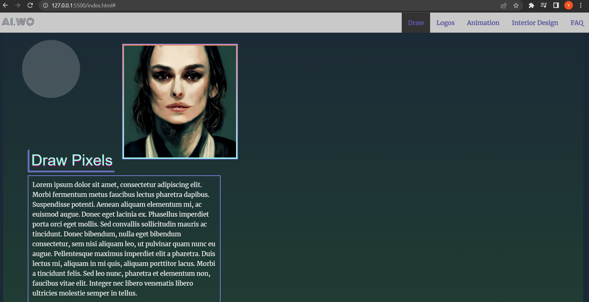

# Ai World Landing Page Project

This project aims to let users experience new technology aspects by using **Ai capabilities** in creating graphic designs not just to be used for an initial idea of a design but it can be a nearly perfect design that needs little adjustments.

## Table of Contents

### General Info

#### This project allows users to create their designs with the help of Ai technology, It can be any type of designs and multiple choices are available for the user:

1. Creating a graphic scene
2. Creating logos
3. Creating an animation
4. Interior design
The user can automatically get to the wanted section through the navigation bar.


### Technologies

#### A list of technologies used within the project:

1. HTML5
2. CSS3
3. ES6 (ES2015)

### Installation

```
$ git clone https://github.com/udacity/fend.git
$ cd d:/fend-refresh-2019/fend-refresh-2019/projects/landing-page
```

### Development

The starter project has some HTML and CSS styling to display a static version of the project, it's development is to make the page **dynamic and responsive** to user interactions and building out the app's functionality using *ES6*.

### Collaboration

*This project is an Open Source project encouraging everyone to engage and contribute.*
Check development notes for Any details on setting up a development environment, running tests, releasing versions...

### Author

*Yomna Ali*

### FAQs

**How to use website after we click on Start Now button?**
*After you get transferred to the next page, You can pick whatever the type of design you want to create then type some specific keywords related to the wanted design, And there you go!!*

**How to get support help regarding some questions about the website?**
*For general usage questions, Use AiWo's help documetation*.
*In case you want to ask other specific questions, Send us an email on AiWo@gmail.com*.